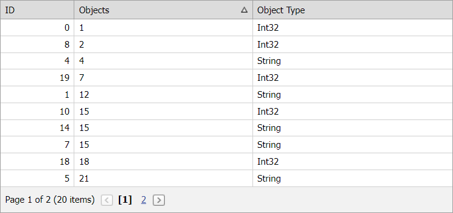

<!-- default badges list -->

<!-- default badges end -->
# Grid View for ASP.NET Web Forms - How to sort a column that contains integer and string values
<!-- run online -->
**[[Run Online]](https://codecentral.devexpress.com/e2958/)**
<!-- run online end -->
This example demonstrates how to sort the Grid View's column that contains values of integer and string types.

To apply a custom sorting algorithm to column data, set the column's [SortMode](https://docs.devexpress.com/AspNet/DevExpress.Web.GridDataColumnSettings.SortMode) property to `Custom` and handle the [CustomColumnSort](https://docs.devexpress.com/AspNet/DevExpress.Web.ASPxGridView.CustomColumnSort) event. In the event handler, compare [Value1](https://docs.devexpress.com/AspNet/DevExpress.Web.GridCustomColumnSortEventArgs.Value1) and [Value2](https://docs.devexpress.com/AspNet/DevExpress.Web.GridCustomColumnSortEventArgs.Value2) event arguments and set the [Result](https://docs.devexpress.com/AspNet/DevExpress.Web.GridCustomColumnSortEventArgs.Result) argument to one of the following values:

* `-1` if `Value1` is less than `Value2`.

* `1` if `Value1` is more than `Value2`.

* `0` if values are equal.

Set the [Handled](https://docs.devexpress.com/AspNet/DevExpress.Web.GridCustomColumnSortEventArgs.Handled) argument property to `false` to use the default mechanism to compare processed values.

## Files to Review

* [Default.aspx](./CS/WebSite/Default.aspx) (VB: [Default.aspx](./VB/WebSite/Default.aspx))
* [Default.aspx.cs](./CS/WebSite/Default.aspx.cs) (VB: [Default.aspx.vb](./VB/WebSite/Default.aspx.vb))

## Documentation

- [Sort Data in Grid View](https://docs.devexpress.com/AspNet/3714/components/grid-view/concepts/sort-data)
- [Grid View Examples](https://docs.devexpress.com/AspNet/3768/components/grid-view/examples)

## More Examples

- [How to sort records based on selection](https://github.com/DevExpress-Examples/asp-net-web-forms-grid-sort-record-based-on-selection)
